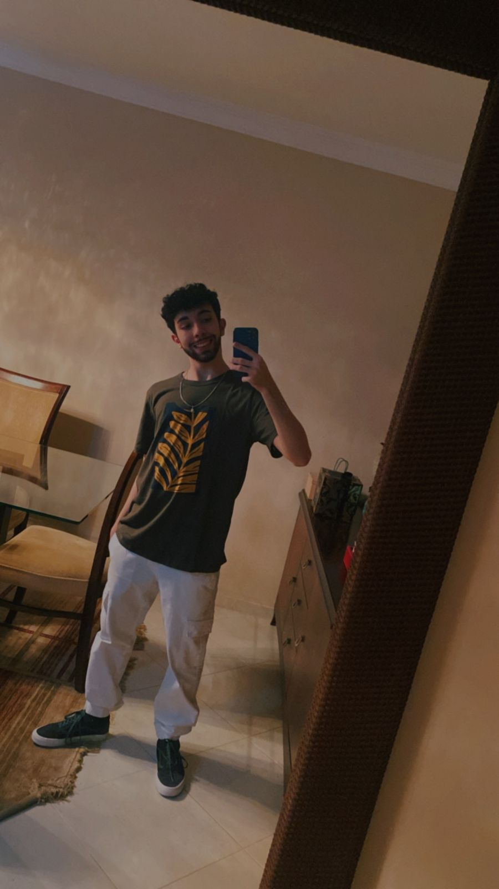
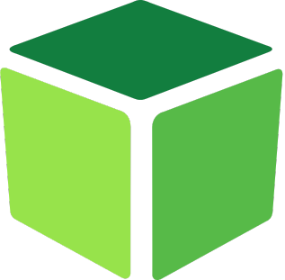
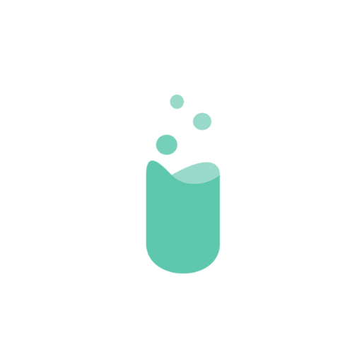

<!--
References used in this Repository
https://github.com/kyechan99/capsule-render
https://github.com/juletopi
https://readme-typing-svg.demolab.com/demo
https://getemoji.com
-->

  
  

  

  

  

  

<!-- ABOUT ME -->

##  Nice to meet you — I'm João Gabriel (bielpieroli)

I'm a Computer Science undergraduate at ICMC‑USP. I love automating workflows, building practical projects, and learning new technologies. Lately I've been focusing on data science and software development. Always eager to learn and collaborate.

🧔🏻 A curious 20-year-old programmer

📍 From Maringá, Paraná, Brazil

🎓 Third-year Computer Science Undergraduate — ICMC, USP

💻 Recently, I have been interested in data science and software development.

🌱 Always learning new technologies and open to collaboration and internships.

&nbsp;

Want to get in touch? My links are below.

<!-- SOCIAL NETWORKS -->

  &nbsp;&nbsp;&nbsp;
  &nbsp;&nbsp;&nbsp;
  
  </a>&nbsp;&nbsp;&nbsp;
  
  </a>&nbsp;&nbsp;&nbsp;
 
  **"Use `ctrl + click` to open it in a new window!"**
  </a>&nbsp;&nbsp;&nbsp;

&nbsp;&nbsp;&nbsp;

<!-- SKILLS -->
<h2>

  
  <h4 style="margin:0;">Tech</h4>

</h2>

<h4 align="center">IDEs & GUIs</h4>

  

    
  

<h4 align="center">DevOps & Productivity</h4>

  

    
    &nbsp;
    &nbsp;
    &nbsp;
    &nbsp;
    &nbsp;
    &nbsp;
    
  

<h4 align="center">Front-end</h4>

  

    &nbsp;
    &nbsp;
    &nbsp;
    &nbsp;
  

    &nbsp;
    &nbsp;
  

<h4 align="center">General Purpose Languages</h4>

  

    &nbsp;
    &nbsp;

<h4 align="center">Data Science</h4>

  

    &nbsp;
    &nbsp;
    &nbsp;
    &nbsp;
    &nbsp;
    &nbsp;
    &nbsp;
  

 
<h3 align="center">&nbsp; Studying for now</h3>

  

    
    
  

 

<!-- STATS -->

<h2>
  

    
    <h4 style="margin:0;">Git Stats</h4>
  

</h2>

[IN CONSTRUCTION]

<!-- EXPERIENCE -->

<h2>
  

    
    <h4 style="margin:0;">Work Experience</h4>
  

</h2>

  
  

    
👔 <strong>PET-Computação (ICMC-USP)</strong>

    
🫂 <strong>6xMember</strong> and <strong>6xCoordinator</strong>

    
📌 <strong>São Carlos, São Paulo, Brazil • (On-Campus)</strong>

    
🗓️ <em><strong>Second semester 2024</strong></em> - <em><strong>First semester 2026</strong></em>

  

&thinsp;

  
  

    
👔 <strong>[PET] Codifique</strong>

    
💬 A course dedicated to teaching programming to high school students in Python

    
🫂 <strong>Teacher</strong> and <strong>Monitor</strong>

    
📌 <strong>São Carlos, São Paulo, Brazil • (On-Campus)</strong>

    
🗓️ <em><strong>Second semester 2024</strong></em> and <em><strong>Second semester 2025</strong></em>

  

&thinsp;

  
  

    
👔 <strong>[PET] Codifikids</strong>

    
💬 A course dedicated to teaching the programming basics to kids using a block-based programming platform

    
🫂 <strong>Teacher</strong> and <strong>Monitor</strong>

    
📌 <strong>São Carlos, São Paulo, Brazil</strong>

    
🗓️ <em><strong>First semester 2025</strong></em> and <em><strong>Second semester 2025</strong></em>

  

&thinsp;

  
  

    
👔 <strong>CodeLab</strong>

    
🫂 <strong>1xMember</strong>

    
📌 <strong>São Carlos, São Paulo, Brazil • (On-Campus)</strong>

    
🗓️ <em><strong>Second semester 2025</strong></em> - Now</em>

  

&thinsp;

  
  

    
👔 <strong>Semcomp (ICMC-USP)</strong>

    
🫂 <strong>2xMember</strong> and <strong>1xCoordinator</strong>

    
📌 <strong>São Carlos, São Paulo, Brazil • (On-Campus)</strong>

    
🗓️ <em><strong>2024</strong></em> - Now</em>

  

<!-- EDUCATION -->

<h2>
  

    
    <h4 style="margin:0;">Education Experience</h4>
  

</h2>

  
  

    
👔 <strong>Drummond School</strong>

    
🫂 <strong>Kindergarten, elementary and High School</strong>

    
📌 <strong>Cianorte, Paraná, Brazil</strong>

    
🗓️ <em><strong>2008</strong></em> - 2023</em>

  

&thinsp;

  
  

    
👔 <strong>ICMC-USP</strong>

    
🫂 <strong>Undergraduate in Computer Science</strong>

    
📌 <strong>São Carlos, São Paulo, Brazil • (On-Campus)</strong>

    
🗓️ <em><strong>2024</strong></em> - Now</em>

  

 

<!-- SPOTIFY PLAYING -->

### <h2>  What to listen in Spotify </h2>

  

  <h3 style="color: white; margin: 12px 0 4px 0;">
    🎧 Golden Hour
  </h3>

  

    JVKE
  

  

<!-- RECENT PROJECTS -->

<!-- Add it later, when I will have them released >

<!-- THANKS FOR VISITING -->

  

